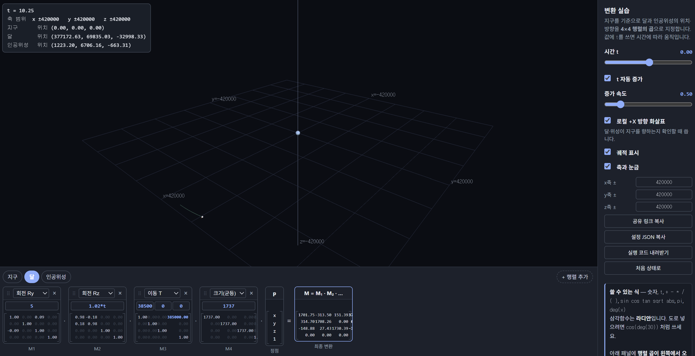
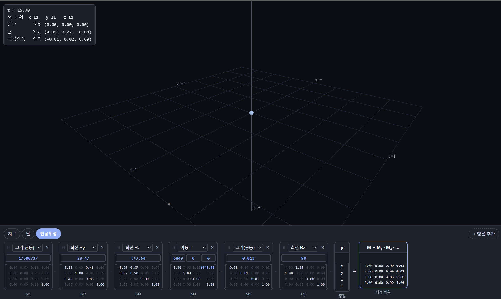
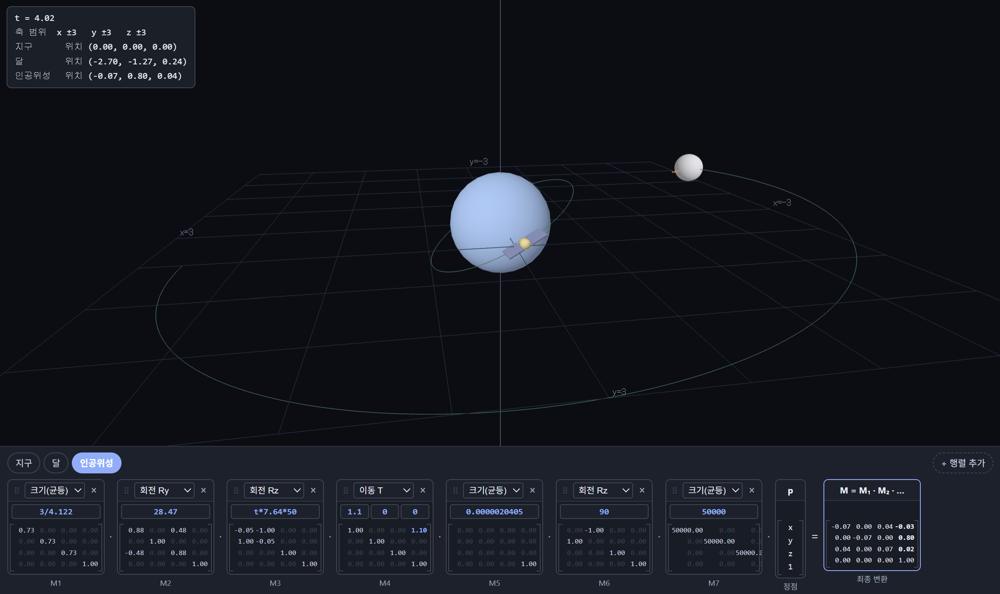

# 2주차 보고서

이름은 **김도현**, 저장소는 `cg-2026-solar-syzygykr` 입니다.

## 조사한 값

대상 인공위성: **허블 우주 망원경**

| 항목 | 값 | 출처 |
| --- | --- | --- |
| 위성의 궤도 반지름 |  6849 km | satellitemap.space |
| 위성의 고도 |  478.2 km | satellitemap.space |
| 위성의 크기 | 길이 13m, 렌즈 구경 2.4m | 나무위키 |
| 위성의 궤도경사각 | 28.47도 | satellitemap.space |
| 위성의 공전속도 | 7.64km/s | satellitemap.space |
| 지구 반지름 | 6371 km | 나무위키 |
| 달까지 거리 | 385000 km | 나무위키 |
| 달의 반지름 | 1737 km | 나무위키 |


## 내가 넣은 변환

## task 1 - 실제 비율 적용 

**JSON**
```
{
  "range": {
    "x": "420000",
    "y": "420000",
    "z": "420000"
  },
  "objects": [
    {
      "id": "earth",
      "name": "지구",
      "color": [
        0.35,
        0.6,
        0.95
      ],
      "steps": [
        {
          "type": "Su",
          "args": [
            "6371"
          ]
        }
      ]
    },
    {
      "id": "moon",
      "name": "달",
      "color": [
        0.78,
        0.78,
        0.82
      ],
      "steps": [
        {
          "type": "Ry",
          "args": [
            "5"
          ]
        },
        {
          "type": "Rz",
          "args": [
            "1.02*t"
          ]
        },
        {
          "type": "T",
          "args": [
            "385000",
            "0",
            "0"
          ]
        },
        {
          "type": "Su",
          "args": [
            "1737"
          ]
        },
        {
          "type": "Rz",
          "args": [
            "180"
          ]
        }
      ]
    },
    {
      "id": "sat",
      "name": "인공위성",
      "color": [
        0.95,
        0.72,
        0.35
      ],
      "steps": [
        {
          "type": "Ry",
          "args": [
            "28.47"
          ]
        },
        {
          "type": "Rz",
          "args": [
            "t*7.64"
          ]
        },
        {
          "type": "T",
          "args": [
            "6849",
            "0",
            "0"
          ]
        },
        {
          "type": "Su",
          "args": [
            "0.013"
          ]
        },
        {
          "type": "Rz",
          "args": [
            "90"
          ]
        }
      ]
    }
  ]
}
```

**설명**

실제 오브젝트의 크기와 거리, 공전속도를 기반으로 1:1 스케일로 구현한 지구 - 허블우주망원경 - 달을 구현함.

**문제점과 해당 문제가 발생한 이유**
- 인공위성과 지구, 달이 너무 작게 표현됨.
  - 지구와 달의 거리에 비해 지구와 달은 너무 작고, 인공위성은 그보다 더 작음. 따라서 지구만 겨우 관측 가능한 형태임.
- 표시되는 달의 공전 궤도가 너무 짧음.
  - 달의 실제 공전속도를 기반으로 실제 초당 이동량을 구현함. 따라서 달은 시뮬레이션이 이루어 지는 시간동안 매우 낮은 각속도로 회전하여 총 회전량이 공전궤도의 1/8에도 미치지 못하는 모습을 관측할 수 있음.


**설정한 변수: 실제와 동일한 값으로 설정함.**
- 허블우주망원경의 크기: 길이 13m
- 허블우주망원경의 공전 궤도 반지름(지구중심으로부터): 6849 km
- 허블우주망원경의 궤도 경사각: 28.47도 (북미-남아프리카공화국 라인을 따라 움직임.)
- 허블우주망원경의 공전속도: 7.64km/s

- 지구의 반지름: 6371km

- 달과 지구 간의 거리: 385000km
- 달의 반지름: 1737km
- 달의 공전속도: 1.022km/s
- 달의 공전궤도 경사각: 5도


**시뮬레이션 결과: 실제 물리적 규모를 그대로 적용한 경우**
- 인간의 시각적 관찰 범위와 일반적인 시뮬레이션 시간만으로는 천체 간 거리와 공전 운동을 직관적으로 표현하기 어렵다는 점을 확인함.


**3가지 과제 질문과 답변**

거리의 단위를 무엇으로 정했는가? 왜 그렇게 정했는가?
- km 단위로 설정함. 가장 일반적이고 직관적인 단위이기 때문임.

숫자가 커서 생긴 문제가 있었는가? 있었다면 무엇인가?
- 지구 - 달 사이의 거리가 압도적으로 커서 지구와 달이 명확하게 표시되지 않음. 

달·위성이 지구를 향하게 만든 것은 어느 변환 단계 덕분인가?
 - 가장 오른편에 추가한 z축 회전이 그 역할을 담당함. 달은 180도 회전시켜 화살표가 항상 지구를 향하고, 인공위성은(우주망원경이므로) 90도 회전시켜 지구의 반대쪽을 관측하는 모습을 묘사함.

**URL**
https://cg.catholic.ac.kr/~mgchoi/CG/demos/d02-transform-lab.html?d=eyJyYW5nZSI6eyJ4IjoiNDIwMDAwIiwieSI6IjQyMDAwMCIsInoiOiI0MjAwMDAifSwib2JqZWN0cyI6W3siaWQiOiJlYXJ0aCIsIm5hbWUiOiLsp4DqtawiLCJjb2xvciI6WzAuMzUsMC42LDAuOTVdLCJzdGVwcyI6W3sidHlwZSI6IlN1IiwiYXJncyI6WyI2MzcxIl19XX0seyJpZCI6Im1vb24iLCJuYW1lIjoi64usIiwiY29sb3IiOlswLjc4LDAuNzgsMC44Ml0sInN0ZXBzIjpbeyJ0eXBlIjoiUnkiLCJhcmdzIjpbIjUiXX0seyJ0eXBlIjoiUnoiLCJhcmdzIjpbIjEuMDIqdCJdfSx7InR5cGUiOiJUIiwiYXJncyI6WyIzODUwMDAiLCIwIiwiMCJdfSx7InR5cGUiOiJTdSIsImFyZ3MiOlsiMTczNyJdfSx7InR5cGUiOiJSeiIsImFyZ3MiOlsiMTgwIl19XX0seyJpZCI6InNhdCIsIm5hbWUiOiLsnbjqs7XsnITshLEiLCJjb2xvciI6WzAuOTUsMC43MiwwLjM1XSwic3RlcHMiOlt7InR5cGUiOiJSeSIsImFyZ3MiOlsiMjguNDciXX0seyJ0eXBlIjoiUnoiLCJhcmdzIjpbInQqNy42NCJdfSx7InR5cGUiOiJUIiwiYXJncyI6WyI2ODQ5IiwiMCIsIjAiXX0seyJ0eXBlIjoiU3UiLCJhcmdzIjpbIjAuMDEzIl19LHsidHlwZSI6IlJ6IiwiYXJncyI6WyI5MCJdfV19XX0%3D


**IMAGE**


- [Task 1 실행하기](https://syzygykr.github.io/cg-2026-solar-syzygykr/week2/task1.html)


## task 2 - NDC 범위에 맞춰 배치

**JSON**
```
{
  "range": {
    "x": "1",
    "y": "1",
    "z": "1"
  },
  "objects": [
    {
      "id": "earth",
      "name": "지구",
      "color": [
        0.35,
        0.6,
        0.95
      ],
      "steps": [
        {
          "type": "Su",
          "args": [
            "1/386737"
          ]
        },
        {
          "type": "Su",
          "args": [
            "6371"
          ]
        }
      ]
    },
    {
      "id": "moon",
      "name": "달",
      "color": [
        0.78,
        0.78,
        0.82
      ],
      "steps": [
        {
          "type": "Su",
          "args": [
            "1/386737"
          ]
        },
        {
          "type": "Ry",
          "args": [
            "5"
          ]
        },
        {
          "type": "Rz",
          "args": [
            "1.02*t"
          ]
        },
        {
          "type": "T",
          "args": [
            "385000",
            "0",
            "0"
          ]
        },
        {
          "type": "Su",
          "args": [
            "1737"
          ]
        },
        {
          "type": "Rz",
          "args": [
            "180"
          ]
        }
      ]
    },
    {
      "id": "sat",
      "name": "인공위성",
      "color": [
        0.95,
        0.72,
        0.35
      ],
      "steps": [
        {
          "type": "Su",
          "args": [
            "1/386737"
          ]
        },
        {
          "type": "Ry",
          "args": [
            "28.47"
          ]
        },
        {
          "type": "Rz",
          "args": [
            "t*7.64"
          ]
        },
        {
          "type": "T",
          "args": [
            "6849",
            "0",
            "0"
          ]
        },
        {
          "type": "Su",
          "args": [
            "0.013"
          ]
        },
        {
          "type": "Rz",
          "args": [
            "90"
          ]
        }
      ]
    }
  ]
}
```


**설명**

task1의 결과물에 오직 배율만을 적용해, -1~1의 NDC 좌표계로 결과물을 압축함.

**적용한 해법**

(지구-달 거리 + 달 반지름)이 총 1 만큼의 거리를 가지게끔 정규화를 진행함.
이는 모든 오브젝트의 모든 좌표축에 대해 1/386737 배율을 적용하는 연산과 동일함.
```
s = 1/386737 = 0.000002585
```
모든 축에 대해서 동일비율로 배율을 적용해야 하므로 크기(균등)으로 처리해도 됨.

**준비물**

1/386737이 언더플로우가 발생하지 않기를 바라는 경건한 마음과 기도

**결과**

성공적

task1과 완벽하게 동일한 구도가 범위만 축소되어 재현됨.
(일부 각도에서 달이 평면 바깥에 있는 것 처럼 보이는 것은 달의 공전 궤도가 해당 평면과 5도 틀어져 있기 때문임.)
깃허브 배포판에서도 정상적으로 표시되지만, 지구가 매우 작게 표현됨.

**4가지 질문과 답변**

s를 얼마로 정했고 그 값을 어떻게 계산했는가?
- 0.000002585. 가장 긴 거리(지구-달 거리 + 달 반지름)를 1로 두고 비율을 구함.

배율 행렬을 사슬의 맨 앞에 넣은 이유는 무엇인가? 맨 뒤에 넣으면 어떻게 되는가?
- 최종적으로 거리를 포함한 모든 계산이 반영된 후 비율을 적용하기 때문.
- 행렬 사슬의 맨 뒤에 넣으면 물체가 이동한 거리는 그대로 유지되고, 물체 자체의 크기만 변함.

세 물체에 같은 배율을 쓴 이유는 무엇인가?
- 세 물체 사이의 관계 역시 같은 비율을 유지하면서 축소해야 하기 때문. 

비율을 유지한 결과, 화면에서 지구와 인공위성은 어떻게 보이는가?
- task1과 동일한데 좌표계만 420000에서 1로 줄어들었음. 깃허브 배포판에서는 매우 작지만 식별가능한 구도로 표시됨.


**URL**
https://cg.catholic.ac.kr/~mgchoi/CG/demos/d02-transform-lab.html?d=eyJyYW5nZSI6eyJ4IjoiMSIsInkiOiIxIiwieiI6IjEifSwib2JqZWN0cyI6W3siaWQiOiJlYXJ0aCIsIm5hbWUiOiLsp4DqtawiLCJjb2xvciI6WzAuMzUsMC42LDAuOTVdLCJzdGVwcyI6W3sidHlwZSI6IlN1IiwiYXJncyI6WyIxLzM4NjczNyJdfSx7InR5cGUiOiJTdSIsImFyZ3MiOlsiNjM3MSJdfV19LHsiaWQiOiJtb29uIiwibmFtZSI6IuuLrCIsImNvbG9yIjpbMC43OCwwLjc4LDAuODJdLCJzdGVwcyI6W3sidHlwZSI6IlN1IiwiYXJncyI6WyIxLzM4NjczNyJdfSx7InR5cGUiOiJSeSIsImFyZ3MiOlsiNSJdfSx7InR5cGUiOiJSeiIsImFyZ3MiOlsiMS4wMip0Il19LHsidHlwZSI6IlQiLCJhcmdzIjpbIjM4NTAwMCIsIjAiLCIwIl19LHsidHlwZSI6IlN1IiwiYXJncyI6WyIxNzM3Il19LHsidHlwZSI6IlJ6IiwiYXJncyI6WyIxODAiXX1dfSx7ImlkIjoic2F0IiwibmFtZSI6IuyduOqzteychOyEsSIsImNvbG9yIjpbMC45NSwwLjcyLDAuMzVdLCJzdGVwcyI6W3sidHlwZSI6IlN1IiwiYXJncyI6WyIxLzM4NjczNyJdfSx7InR5cGUiOiJSeSIsImFyZ3MiOlsiMjguNDciXX0seyJ0eXBlIjoiUnoiLCJhcmdzIjpbInQqNy42NCJdfSx7InR5cGUiOiJUIiwiYXJncyI6WyI2ODQ5IiwiMCIsIjAiXX0seyJ0eXBlIjoiU3UiLCJhcmdzIjpbIjAuMDEzIl19LHsidHlwZSI6IlJ6IiwiYXJncyI6WyI5MCJdfV19XX0%3D

**IMAGE**


- [Task 2 실행하기](https://syzygykr.github.io/cg-2026-solar-syzygykr/week2/task2.html)


## task 3 - 보는 사람을 위해 조절

**JSON**
```
{
  "range": {
    "x": "3",
    "y": "3",
    "z": "3"
  },
  "objects": [
    {
      "id": "earth",
      "name": "지구",
      "color": [
        0.35,
        0.6,
        0.95
      ],
      "steps": [
        {
          "type": "Su",
          "args": [
            "3/4.122"
          ]
        },
        {
          "type": "Su",
          "args": [
            "0.6931"
          ]
        }
      ]
    },
    {
      "id": "moon",
      "name": "달",
      "color": [
        0.78,
        0.78,
        0.82
      ],
      "steps": [
        {
          "type": "Su",
          "args": [
            "3/4.122"
          ]
        },
        {
          "type": "Ry",
          "args": [
            "5"
          ]
        },
        {
          "type": "Rz",
          "args": [
            "1.02*t*50"
          ]
        },
        {
          "type": "T",
          "args": [
            "4.117",
            "0",
            "0"
          ]
        },
        {
          "type": "Su",
          "args": [
            "0.241095"
          ]
        },
        {
          "type": "Rz",
          "args": [
            "180"
          ]
        }
      ]
    },
    {
      "id": "sat",
      "name": "인공위성",
      "color": [
        0.95,
        0.72,
        0.35
      ],
      "steps": [
        {
          "type": "Su",
          "args": [
            "3/4.122"
          ]
        },
        {
          "type": "Ry",
          "args": [
            "28.47"
          ]
        },
        {
          "type": "Rz",
          "args": [
            "t*7.64*50"
          ]
        },
        {
          "type": "T",
          "args": [
            "1.1",
            "0",
            "0"
          ]
        },
        {
          "type": "Su",
          "args": [
            "0.0000020405"
          ]
        },
        {
          "type": "Rz",
          "args": [
            "90"
          ]
        },
        {
          "type": "Su",
          "args": [
            "50000"
          ]
        }
      ]
    }
  ]
}

```

**설명**

내가 설정한 단위계는 지구 반지름 기준 로그 스케일로 압축된 거리 + 독립적으로 확대된 오브젝트 조합이다.
나는 이 조합을 통해서 각 오브젝트의 공전 궤도를 명확하게 보여주는 일종의 학습자료를 만들고자 한다.
특히 각각의 오브젝트의 공전궤도가 지구 적도에 비해 얼마나 기울어져 있는가를 보여주고자 한다.

그래서 만약에 하나의 오브젝트를 더 추가한다면, 거의 90도에 가까운 각도로 극궤도를 도는 위성을 하나 더 추가하고 싶다.

거리 로그스케일 압축: f(r) = log(1+r/지구r) (로그는 자연로그 기준)
변경되는 값:
 - 지구 반지름: log(1 + 6371/6371) = 0.6931
 - 인공위성 공전궤도 반지름: log(1 + 6849/6371) = 0.73
 - 달 공전궤도 반지름: log(1 + 385000/6371) = 4.117
 - 인공위성의 크기: log(1 + 0.013/6371) = 0.0000020405
 - 달의 반지름: log(1 + 1737/6371) = 0.241095
 - 달 표면까지의 최대 거리: log(1+386737/6371) = 4.122

 - 총 배율: 4.122 : 1 이므로 s = 1/4.122 = 0.2426

오브젝트 확대: 달 1배율(로그 스케일만 적용됨), 인공위성 50000배

보정: 인공위성 궤도가 너무 낮아 인공위성이 지구와 겹치는 문제를 해결하기 위해
인공위성 궤도의 반지름을 1.5배 확장하는 시각화 보정 배율이 추가로 적용됨.

공전속도 배율
실제 공전 속도는 달 1.022 km/s, 인공위성 7.64 km/s를 기준으로 하되, 시각화 과정에서 움직임을 확인하기 어렵다는 문제를 해결하기 위해 두 오브젝트 모두 50배의 속도 보정을 적용하였다. 속도의 단위는 km/s를 유지하였다.
단, 실제 물리 시뮬레이션에서는 로그 단위 축척을 적용하는 과정에서 각속도가 달라지고, 거리와 속도의 값이 달라지므로, 이는 단순히 시각화용 보정값임을 명시한다.

달: 1.022 km/s × 50 = 51.1 km/s
인공위성: HST: 7.64 km/s × 50 = 382 km/s

전체 좌표계: 1 -> 3
전체 좌표계의 시각적 크기를 1에서 3으로 확대하여 오브젝트와 공전 궤도를 더욱 명확하게 관찰할 수 있도록 하였다.

위의 보정이 모두 적용된 천체는 "실제 비율" 이 아닌, 달과 인공위성의 공전궤도를 보여주기 위한 시각적 교육자료이다.


**3가지 질문과 답변**

실제 비율이 정보를 전달하기에 적합한지 판단하고 그 이유를 쓰세요.
- 아님. 지구-달 사이 거리가 너무 거대해서 다른 모든 요소가 뭉개지는 것을 확인함. 특히 위성의 경우에는 그 존재 유무를 파악할 수도 없을만큼 작게 표시됨을 확인함.

더 나은 표현 방법을 하나 이상 제안하고 실제로 만들어 보세요. (예: 크기만 과장하기, 거리를 로그로 압축하기, 축척 막대를 함께 보여 주기 등)
- 오브젝트 간의 거리는 지구 반지름을 기준으로 삼는 로그 스케일로, 오브젝트의 크기는 일정비율 과장하는 복합 묘사법이다. 왜냐하면 내가 이 페이지를 만드는 이유는 행성과 인공위성의 공전 궤도의 형태를 보여주고자 함이고, 그 사이의 실질적인 거리가 아니기 때문이다.
그리고 이걸 적용하면 공전속도 또한 실제와 다른 배율을 적용하게 된다.

제안한 방법의 장점과 잃는 것을 함께 쓰세요.
- 위성과 달이라는 두 가지 오브젝트에 포커스를 맞추기 좋다. 이 둘이 어떤 궤도로 공전하는가? 를 한눈에 알아보기 좋지만, 그 둘이 천문학적인 관점에서 대체 얼마나 떨어져 있는가는 알아볼 수 없다.
광활한 우주를 실제 축척으로 보여주는 스페이스 오페라 장르의 영화나 다큐멘터리에는 적합하지 않은 축척법이라고 생각한다.
```

**URL**
https://cg.catholic.ac.kr/~mgchoi/CG/demos/d02-transform-lab.html?d=eyJyYW5nZSI6eyJ4IjoiMyIsInkiOiIzIiwieiI6IjMifSwib2JqZWN0cyI6W3siaWQiOiJlYXJ0aCIsIm5hbWUiOiLsp4DqtawiLCJjb2xvciI6WzAuMzUsMC42LDAuOTVdLCJzdGVwcyI6W3sidHlwZSI6IlN1IiwiYXJncyI6WyIzLzQuMTIyIl19LHsidHlwZSI6IlN1IiwiYXJncyI6WyIwLjY5MzEiXX1dfSx7ImlkIjoibW9vbiIsIm5hbWUiOiLri6wiLCJjb2xvciI6WzAuNzgsMC43OCwwLjgyXSwic3RlcHMiOlt7InR5cGUiOiJTdSIsImFyZ3MiOlsiMy80LjEyMiJdfSx7InR5cGUiOiJSeSIsImFyZ3MiOlsiNSJdfSx7InR5cGUiOiJSeiIsImFyZ3MiOlsiMS4wMip0KjUwIl19LHsidHlwZSI6IlQiLCJhcmdzIjpbIjQuMTE3IiwiMCIsIjAiXX0seyJ0eXBlIjoiU3UiLCJhcmdzIjpbIjAuMjQxMDk1Il19LHsidHlwZSI6IlJ6IiwiYXJncyI6WyIxODAiXX1dfSx7ImlkIjoic2F0IiwibmFtZSI6IuyduOqzteychOyEsSIsImNvbG9yIjpbMC45NSwwLjcyLDAuMzVdLCJzdGVwcyI6W3sidHlwZSI6IlN1IiwiYXJncyI6WyIzLzQuMTIyIl19LHsidHlwZSI6IlJ5IiwiYXJncyI6WyIyOC40NyJdfSx7InR5cGUiOiJSeiIsImFyZ3MiOlsidCo3LjY0KjUwIl19LHsidHlwZSI6IlQiLCJhcmdzIjpbIjEuMSIsIjAiLCIwIl19LHsidHlwZSI6IlN1IiwiYXJncyI6WyIwLjAwMDAwMjA0MDUiXX0seyJ0eXBlIjoiUnoiLCJhcmdzIjpbIjkwIl19LHsidHlwZSI6IlN1IiwiYXJncyI6WyI1MDAwMCJdfV19XX0%3D

**IMAGE**


- [Task 3 실행하기](https://syzygykr.github.io/cg-2026-solar-syzygykr/week2/task3.html)

