# 3주차 보고서

이름은 **김도현/syzygykr**, 저장소는 `cg-2026-solar-syzygykr` 입니다.

## Task1: 삼각형에서 3차원 장면까지 

**확인 질문과 답변**

확인 질문 — 삼각형의 꼭짓점은 3개인데 화면의 색은 부드럽게 이어집니다. 누가 그 사이를 채웠습니까?
- 래스터화 단계가 자동으로 정점 사이의 픽셀을 생성하고, 정점의 색상을 보간하여 부드럽게 이어서 채움.

### Task1_1단계(스크린샷 O)

```
  gl.enable(gl.DEPTH_TEST);
```

위의 코드를 주석처리하자 깊이값을 고려하지 않아 렌더링이 이상해지는 모습을 확인함. 

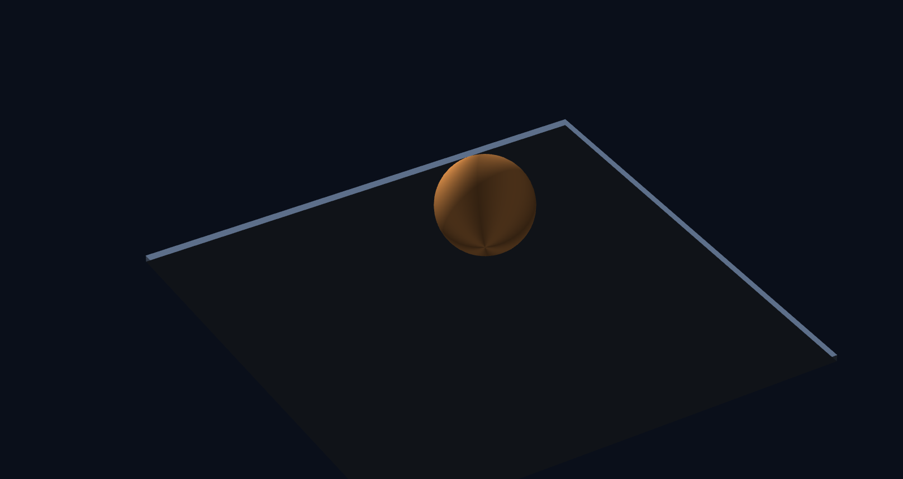


### Task1_2단계

공과 바닥면을 추가함 - 공이 바닥면 위에 떠 있음.


### Task1_3단계

물체를 세계 속 제자리에 놓고, 카메라에서 본 모습으로 바꿈


### Task1_4단계

RotateZ 추가 - 3주차의 예제 코드에 2주차의 행렬연산을 그대로 적용함.

```
// z축 회전 — 2주차의 Rz
M4.rotateZ = function (angle) {
  const c = Math.cos(angle);
  const s = Math.sin(angle);
  return new Float32Array([
    c, -s, 0, 0,
    s,  c, 0, 0,
    0,  0, 1, 0,
    0,  0, 0, 1,
  ]);
};
```


### Task1_5단계 

②~⑥ 의 변환을 적용함
여기서 공을 높은 곳에서 대각선으로 내려다보는 시점이 적용됨.


### Task1_6단계 (스크린샷 O)

구는 어디서 봐도 똑같이 생겨서, 색이 한 가지면 도는지 알 수 없습니다. 그래서 위 makeSphere 는 경도에 따라 밝기를 조금씩 다르게 두었습니다. 그 줄(const shade = ...)을 지우면 어떻게 되는지 확인해 보세요.
 - 경도에 따라 적용된 주기적인 음영이 사라져 직관적으로 구의 자전을 확인하기 힘들어짐


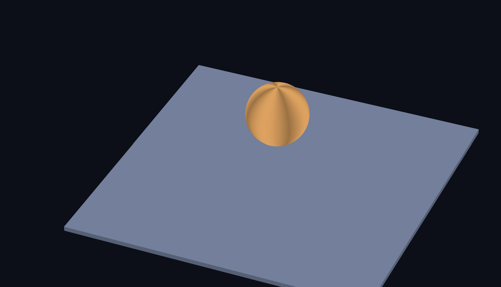

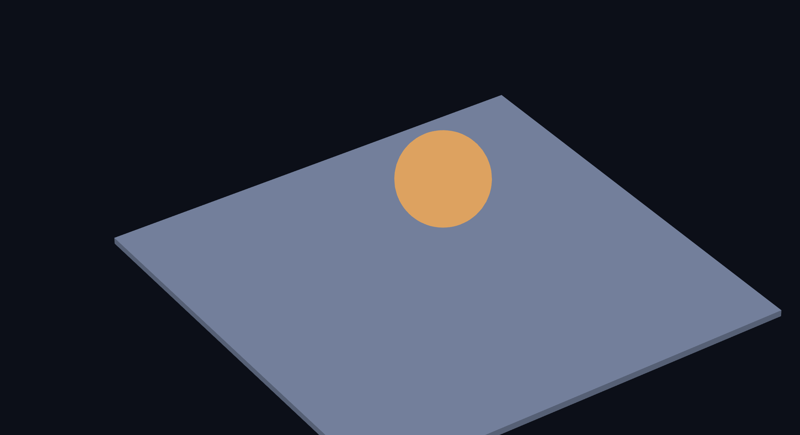


```
 const model = M4.multiply(M4.rotateY(time * 0.8), M4.translate(0, 1.9, 0));
```

이렇게 바꾸면 공이 제자리에서 도는 대신 원을 그리며 공전합니다. 왜 그런지 2주차 2절의 「오른쪽부터 적용된다」로 설명해 보세요. 이 비교를 보고서에 캡처와 함께 넣으세요.
 - 행렬 곱은 오른쪽부터 정점에 적용되므로 원래 식에서의 적용 순서는
1. 공을 원점에서 y축 기준으로 회전한다.
2. 그 회전한 공 전체를 위로 1.9만큼 이동한다.
회전할 때 공의 중심은 원점에 있으므로, 공은 y = 1.9 위치에서 제자리 자전함.


하지만 바꾼 식은
```
const model = M4.multiply(M4.rotateY(time * 0.8), M4.translate(0, 1.9, 2));
```
(z값이 없어서 오브젝트가 이동하지 않는, 즉 공전 궤도 반지름이 0인 현상이 발생해 임의로 z=2 값 부여)

이므로:
1. 먼저 공의 중심을 (0, 1.9, 2)으로 옮김
2. 그 위치 벡터까지 포함해 y축 기준으로 회전함
즉, 원점에서 떨어진 공의 중심 자체가 y축 주위를 회전하므로 공전이 생김


### Task1_7단계 (스크린샷 O)

프래그먼트 셰이더로 빛을 추가함


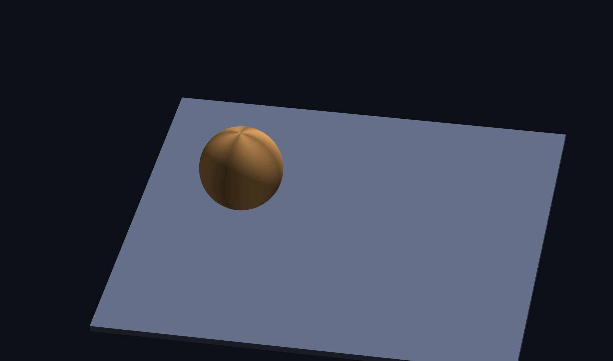

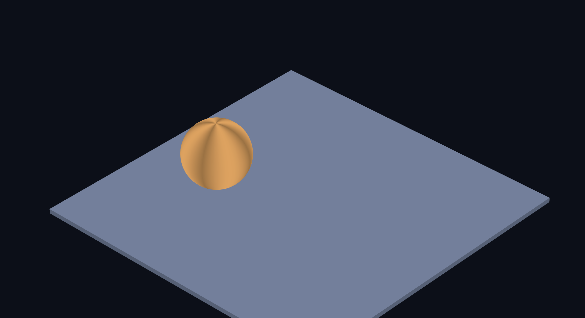


### Task1_8단계

실습실의 셰이더를 가져와 코드에 적용하기

1. 법선을 색으로 (vec4(N*0.5+0.5, 1.0))
구 표면이 무지개처럼 물듭니다. 바닥은 왜 몇 가지 색뿐입니까?
 - 구는 표면의 법선 방향이 3차원 공간에서 연속적으로 변하므로 다양한 색상이 나타남. 하지만 바닥은 평면이므로 모든 지점의 법선 방향이 거의 동일하기 때문.

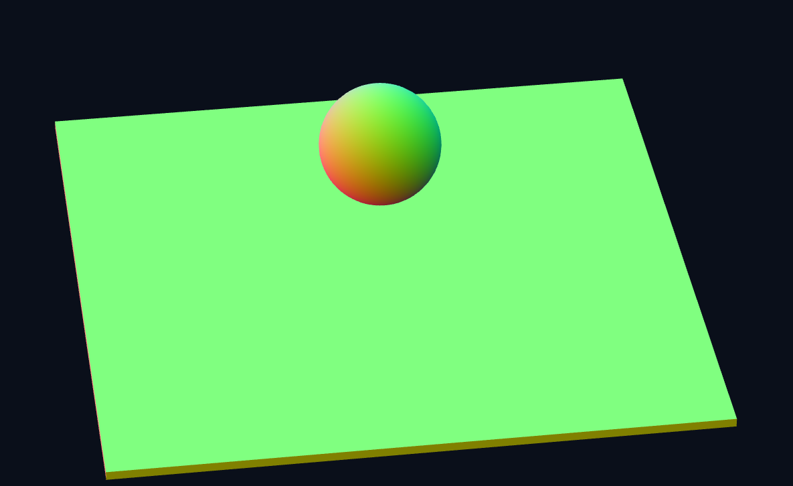

2. 계단식 음영 (floor(d*4.0)/4.0)
부드럽던 명암이 몇 단계로 끊깁니다
 - 부드럽게 변화하던 명암이 몇 개의 뚜렷한 색상 영역으로 나뉘게 됨.

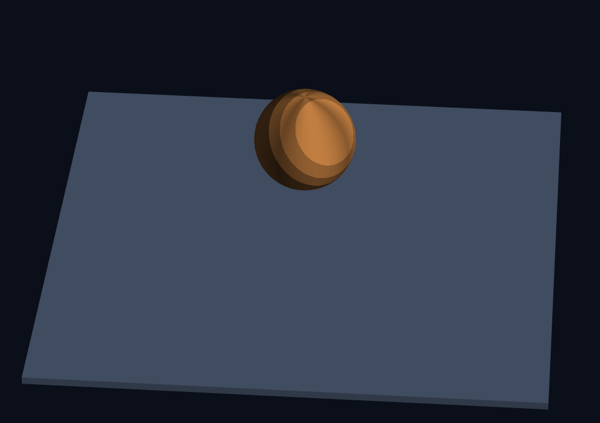

3. uTime 을 쓰는 셰이더
시간이 셰이더에 실제로 전달되고 있음을 확인하세요
 - 시간에 따라 오브젝트가 밝아졌다 어두워지는 아래의 코드를 사용함.


 ```
 #version 300 es

precision highp float;

in vec3 vColor;
uniform float uTime;

out vec4 fragColor;

void main() {
    float brightness = 0.5 + 0.5 * sin(uTime);
    fragColor = vec4(vColor * brightness, 1.0);
}
```


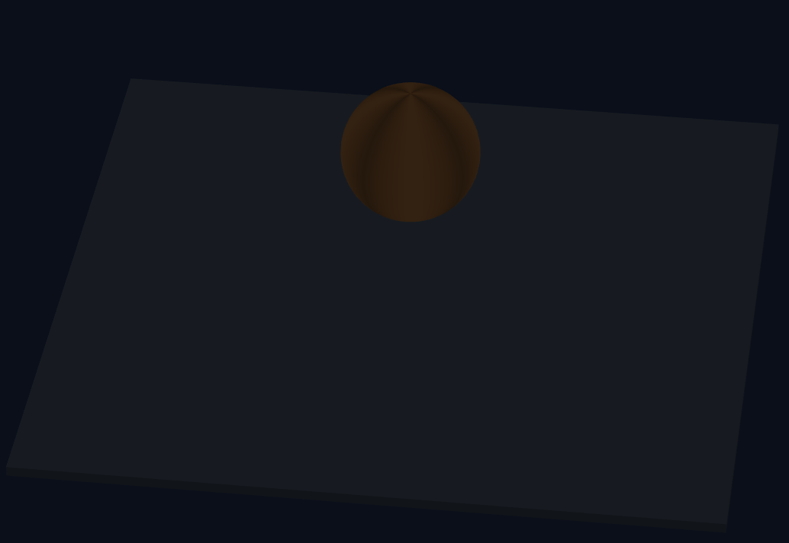


### Task1_최종 결과물 (스크린샷 O)

코드의 6구역과 그 역할

구역1 - 메시데이터: 바닥과 공의 정점 정보

구역2 - 버텍스 셰이더: 정점마다 실행되어 정점 위치를 화면에 그릴 위치로 변환

구역3 - 프래그먼트 셰이더: 픽셀마다 실행되어 최종 색을 계산

구역4 - WebGL 준비: 프로그램을 만들고, 회전 이동 크기 등 각종 함수를 정의함

구역5 - 버퍼 만들기: 공과 바닥 메시가 실질적으로 준비되는 단계

구역6 - 렌더링: 매 프레임 화면을 그려냄


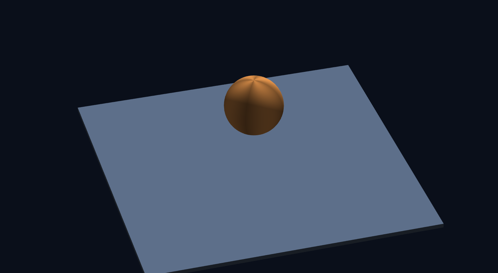


## Task2: 삼각형에서 3차원 장면까지 - 첫 번째 행성

컨셉: 스타워즈의 "죽음의 별"에서 모티브를 얻은, 균일한 격자무늬에 빛이 점멸되며 한 점에 거대한 반사 레이저가 달린 인공행성


| 구현 요소 | 사용한 기법 | 상세 설명 |
|---|---|---|
| **기계식 격자 패널** | `floor`, `fract` | 구체 표면의 좌표를 일정한 크기의 격자 단위로 분할하여 기계적인 패널 구조를 구현하였다. `floor`를 이용해 각 패널의 정수 인덱스를 구하고, `fract`를 통해 패널 내부의 상대적인 좌표를 계산한다. 이를 바탕으로 구체 표면 전체에 반복되는 격자 패턴을 생성하였다. |
| **패널 경계 및 이음새** | `panelEdge`, `smoothstep` | 각 패널의 가장자리에서 경계까지의 거리를 계산하고, 이를 이용해 패널 사이의 이음새를 표현하였다. 경계 부분을 어둡게 처리하여 각각의 패널이 독립적인 금속판으로 구성된 것처럼 보이게 하였다. |
| **패널별 색상 변화** | `hash21` | 각 패널의 좌표를 입력으로 사용하여 의사난수를 생성한다. 생성된 값을 패널의 색상에 반영하여 모든 패널이 동일한 색상으로 보이는 것을 방지하고, 다양한 금속 표면이 조합된 듯한 시각적 효과를 구현하였다. |
| **점멸하는 시설 조명** | `sin`, `uTime`, `hash21` | 패널의 좌표를 기반으로 조명의 위치와 점멸 특성을 결정하였다. `uTime`을 이용해 시간에 따라 조명의 밝기를 변화시키고, 패널마다 서로 다른 위상과 주기를 적용하여 인공 행성 표면에 여러 시설 조명이 작동하는 듯한 효과를 구현하였다. |
| **중앙 레이저 장치의 위치 및 형태** | `dot`, `acos`, `smoothstep` | 구체 표면에서 레이저 장치가 위치할 방향을 지정하고, 표면의 방향 벡터와 장치의 중심 방향 사이의 각도를 계산하였다. 이 각도를 기준으로 원형 영역을 정의하고, `smoothstep`을 이용해 경계를 부드럽게 처리하여 구체 표면에 거대한 원형 장치가 배치된 것처럼 표현하였다. |
| **레이저 장치의 동심원** | `length`, `sin` | 레이저 장치의 중심을 기준으로 표면 좌표의 거리를 계산하고, 이를 이용해 여러 개의 동심원 패턴을 생성하였다. 각 원의 위치와 간격을 조절하여 장치 내부에 복잡한 기계 구조가 존재하는 것처럼 표현하였다. |
| **레이저 장치의 중심부** | `smoothstep`, `uTime` | 동심원 구조의 중심에 어두운 영역과 발광 영역을 배치하여 레이저 장치의 핵심부를 표현하였다. 또한 시간에 따라 발광 강도를 변화시켜 장치가 에너지를 충전하거나 작동하는 듯한 시각적 효과를 구현하였다. |
| **적도 부근의 구조물** | `smoothstep`, 표면 좌표 | 구체 표면의 수직 좌표를 기준으로 적도 부근에 어두운 띠를 형성하였다. 이를 통해 행성 표면에 별도의 구조물이 둘러져 있는 듯한 외관을 구현하였다. 레이저 장치 영역에는 해당 효과가 적용되지 않도록 마스크를 사용하여 두 요소가 겹치는 문제를 방지하였다. |
| **표면 조명** | `dot`, 광원 방향 벡터 | 표면의 법선 벡터와 광원 방향 벡터의 내적을 이용하여 표면이 광원을 향하는 정도를 계산하였다. 이를 기반으로 각 패널의 밝기를 결정하여 행성의 입체감을 표현하였다. |
| **금속 표면의 반사광** | `dot`, `pow` | 광원 방향과 시선 방향을 이용해 반사광을 계산하고, `pow`를 통해 반사광의 강도를 조절하였다. 이를 기본 표면 색상에 더하여 금속 재질 특유의 반짝이는 느낌을 표현하였다. |
| **최종 색상 합성** | 색상 및 조명 합산 | 패널의 기본 금속 색상, 표면 조명, 반사광, 자체 발광 효과를 합산하여 최종 픽셀 색상을 결정하였다. 이를 통해 격자 구조와 레이저 장치, 시설 조명이 하나의 행성 표면에 자연스럽게 결합되도록 구현하였다. |


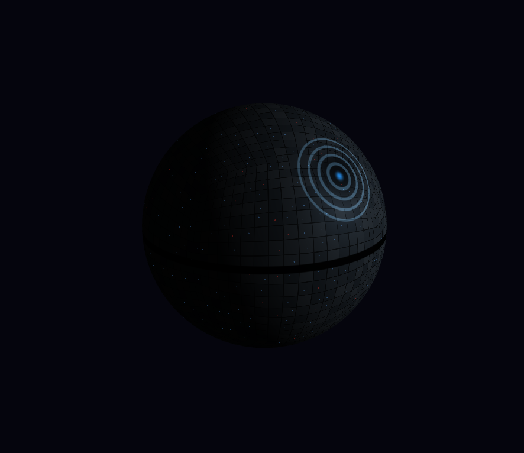


## Task3: 삼각형에서 3차원 장면까지 - 두 번째 행성

컨셉: 하나의 고리를 가진 검붉은 균열 행성. 거의 검은색의 행성이지만 밤에는 맥동하는 붉은 균열에서 끝없는 에너지가 새어나온다.

| 구현 요소           | 사용한 기법                            | 상세 설명                                                                                                                   |
| --------------- | --------------------------------- | ----------------------------------------------------------------------------------------------------------------------- |
| **의사난수 생성**     | `hash31R`, `fract`                | 3차원 좌표를 입력받아 0~1 범위의 의사난수 값을 생성한다. 동일한 좌표에는 항상 같은 값이 반환되므로, 표면의 불규칙한 질감과 균열의 맥동 위상을 결정하는 데 활용한다.                        |
| **3차원 노이즈 생성**  | `noiseR`, `floor`, `fract`, `mix` | 입력 좌표를 정수 격자와 소수 부분으로 분리한 뒤, 주변 8개 격자 꼭짓점의 의사난수 값을 보간한다. 소수 부분에 부드러운 보간 곡선을 적용하여 격자 경계가 자연스럽게 이어지는 3차원 노이즈를 생성한다.       |
| **프랙탈 노이즈 생성**  | `fbmR`, 반복문, 진폭 감소                | 서로 다른 주파수의 노이즈를 4회 중첩하여 다양한 크기의 표면 패턴을 생성한다. 반복할 때마다 좌표의 주파수를 약 2배로 높이고 진폭을 절반으로 줄여 큰 형태와 작은 질감이 함께 나타나도록 한다.           |
| **표면 좌표 계산**    | `normalize(vSurf)`                | 구체 표면의 물체 기준 좌표를 정규화하여 표면의 방향 벡터 `S`를 구한다. 이 좌표를 기반으로 표면 질감과 균열을 생성하므로, 행성이 회전할 때 균열도 표면에 고정된 상태로 함께 회전한다.              |
| **표면의 기본 질감**   | `fbmR`, `mix`                     | 표면 좌표에 노이즈를 적용하여 암석과 같은 불규칙한 질감을 생성한다. 노이즈 값 `rough`에 따라 거의 검은색인 색상과 어두운 적갈색을 혼합하여 표면에 미세한 색상 변화를 부여한다.                 |
| **균열 좌표 왜곡**    | `fbmR`, `warped`                  | 표면 좌표에 서로 다른 위치에서 계산한 3차원 노이즈를 더해 좌표를 변형한다. 이를 통해 규칙적인 사인 함수로 생성되는 선을 구부러지게 만들어 자연스럽고 불규칙한 균열 형태를 구현한다.                 |
| **균열 패턴 생성**    | `sin`, `abs`, `min`               | 변형된 좌표의 서로 다른 축 조합에 사인 함수를 적용하여 세 종류의 선형 패턴을 생성한다. 절댓값으로 선의 양쪽을 대칭적으로 처리하고, 세 패턴 중 가장 작은 값을 선택하여 여러 방향으로 이어지는 균열망을 만든다. |
| **균열의 폭 변화**    | `fbmR`, `widthNoise`              | 표면 좌표에 추가 노이즈를 적용하여 균열의 폭을 결정하는 값을 생성한다. 이 값을 균열 마스크의 경계에 반영하여 균열이 일정한 폭을 갖지 않고 구간마다 넓어지거나 좁아지는 효과를 구현한다.               |
| **균열 주변 발광 영역** | `smoothstep`, `crackGlow`         | 균열 패턴 값과 폭을 기준으로 발광 영역을 계산한다. 중심부보다 넓은 범위에 마스크를 적용하여 균열 주변까지 붉은빛이 퍼지는 듯한 효과를 표현한다.                                      |
| **균열 중심부**      | `smoothstep`, `crackCore`         | 발광 영역보다 좁은 범위에 별도의 마스크를 적용하여 균열의 중심부를 구분한다. 중심부에는 더 밝은 붉은색을 적용하여 균열 내부에서 에너지가 집중적으로 방출되는 듯한 모습을 구현한다.                   |
| **균열별 맥동 위상**   | `hash31R`, `floor`                | 표면 좌표를 일정한 단위로 나누고 각 영역의 의사난수를 계산한다. 이 값을 맥동의 위상과 주기에 반영하여 영역마다 서로 다른 시점과 속도로 밝기가 변하도록 한다.                              |
| **시간에 따른 맥동**   | `sin`, `uTime`, `pulse`           | 시간 유니폼 `uTime`을 사인 함수에 적용하여 균열의 밝기가 주기적으로 변화하도록 한다. 기본 밝기를 유지하면서 시간에 따라 밝기가 증가하거나 감소하는 효과를 구현한다.                        |
| **암석 색상 설정**    | `mix`, `rough`                    | 거의 검은색인 기본 색상과 어두운 적갈색을 `rough` 값에 따라 혼합한다. 이를 통해 행성 표면의 어두운 분위기를 유지하면서 단조로운 단색 표면을 방지한다.                               |
| **균열의 색상 변화**   | `mix`, `crackCore`                | 균열 중심부 마스크를 사용하여 어두운 붉은색과 밝은 주황빛 붉은색을 혼합한다. 중심부에 가까울수록 밝은 색상이 나타나도록 하여 균열의 깊이와 에너지 집중을 시각적으로 표현한다.                      |
| **표면 조명**       | `dot`, `max`                      | 표면의 법선 벡터 `N`과 광원 방향 벡터 `L`의 내적을 계산하여 표면이 광원을 향하는 정도를 구한다. 이를 이용해 암석 표면의 밝기를 조절하고 구체의 입체감을 표현한다.                        |
| **균열의 자체 발광**   | `crackGlow`, `pulse`, 색상 합산       | 기본 표면 조명과 별개로 균열 마스크, 맥동 값, 발광 색상을 곱하여 최종 색상에 더한다. 따라서 직접 조명을 받지 않는 부분에서도 균열이 붉게 빛나는 효과를 표현할 수 있다.                      |
| **최종 색상 합성**    | `vec3` 색상 합산                      | 암석의 기본 색상에 표면 조명을 적용한 뒤, 균열의 발광 효과를 더하여 최종 색상을 계산한다. 이를 통해 어두운 암석 표면과 붉은 균열이 하나의 표면에 결합되도록 한다.                          |


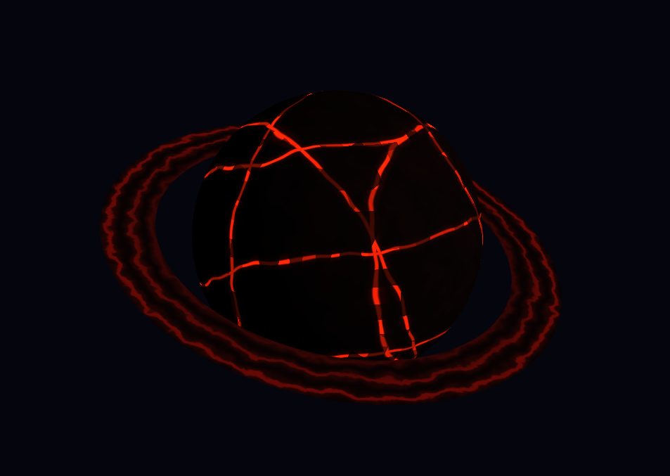