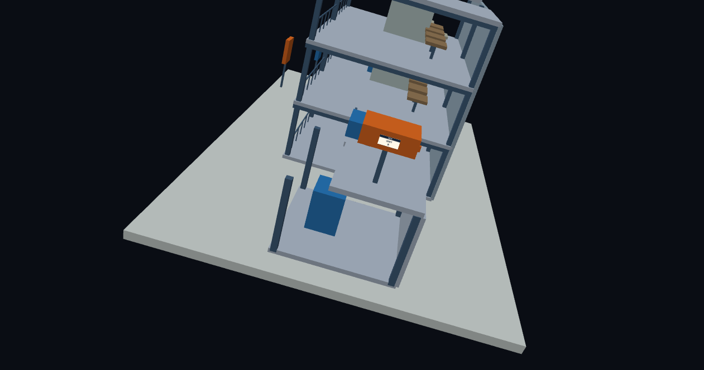
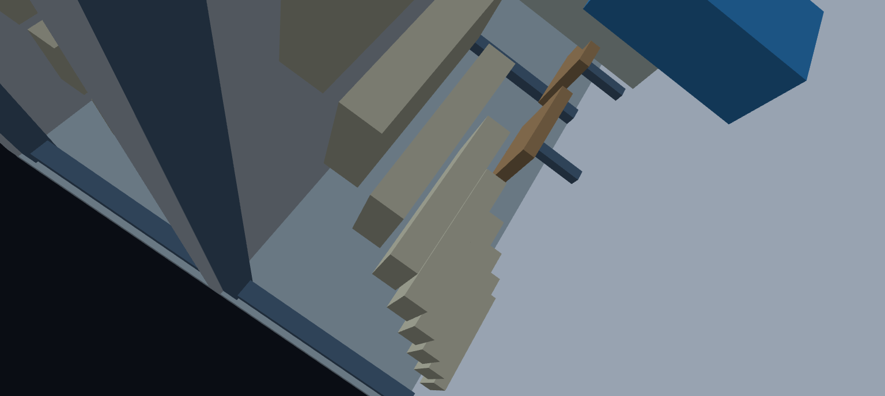
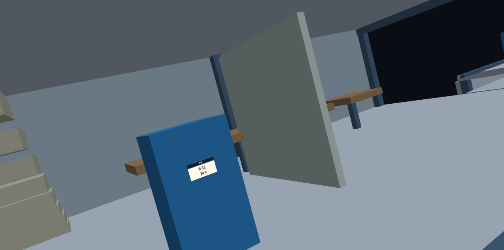
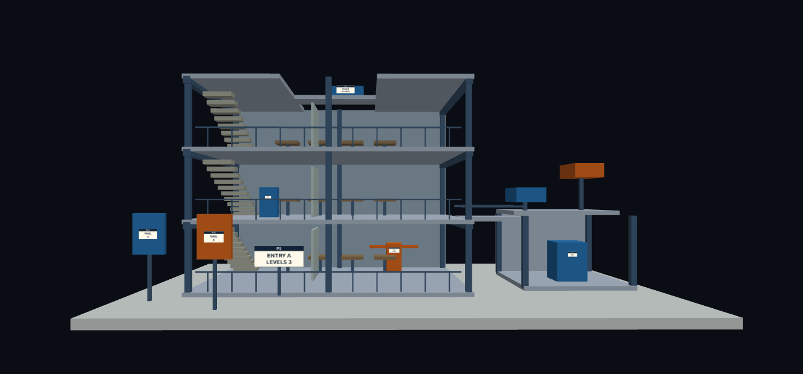
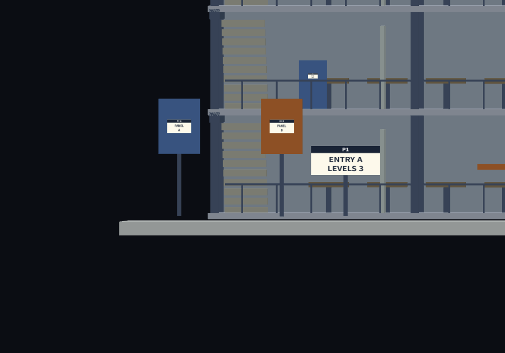
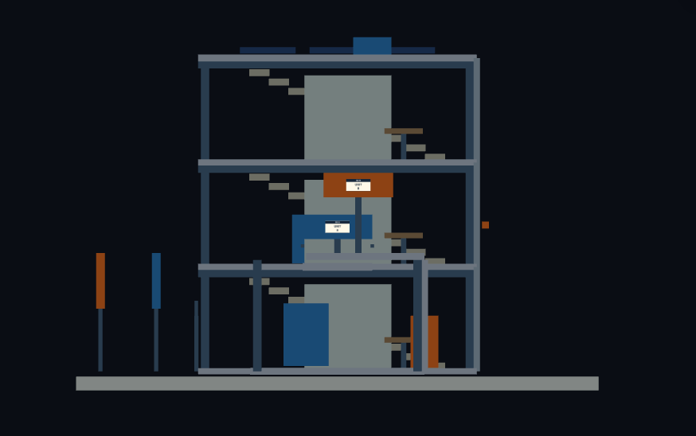
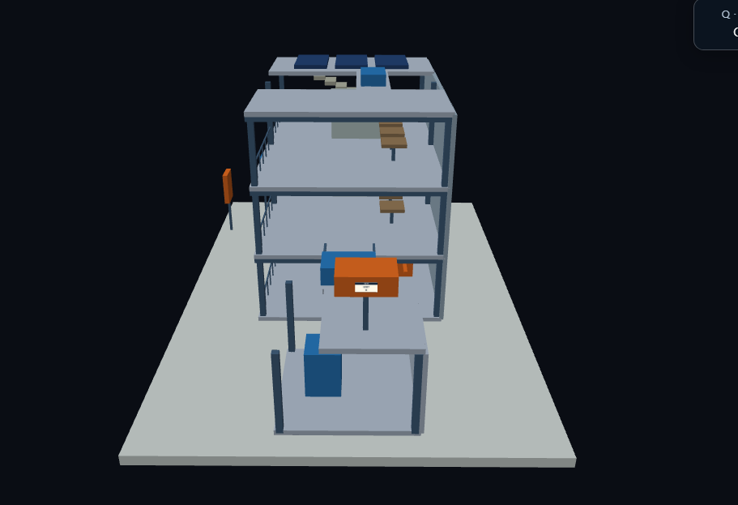
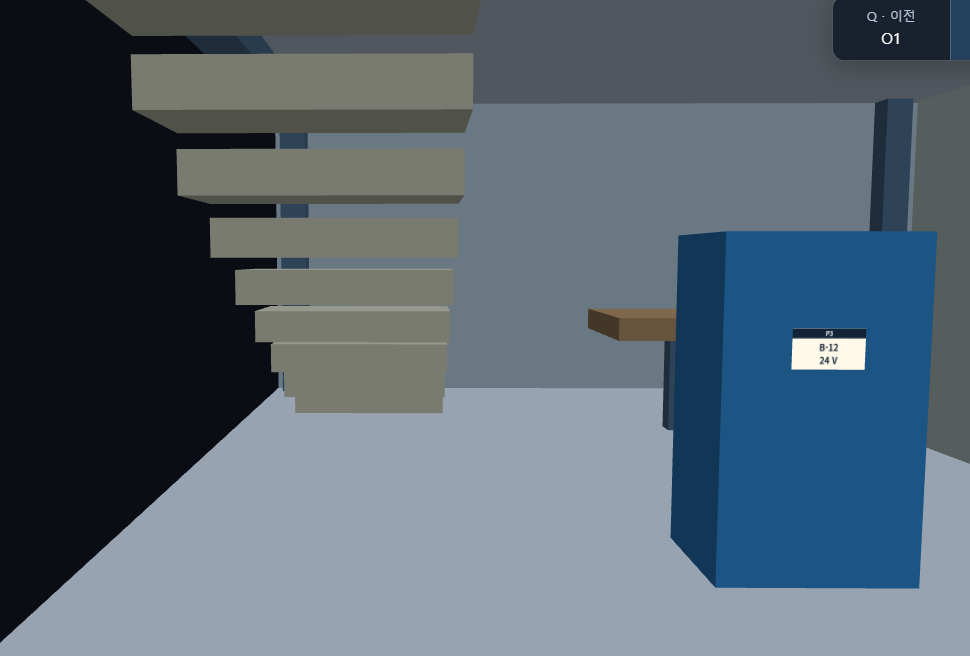
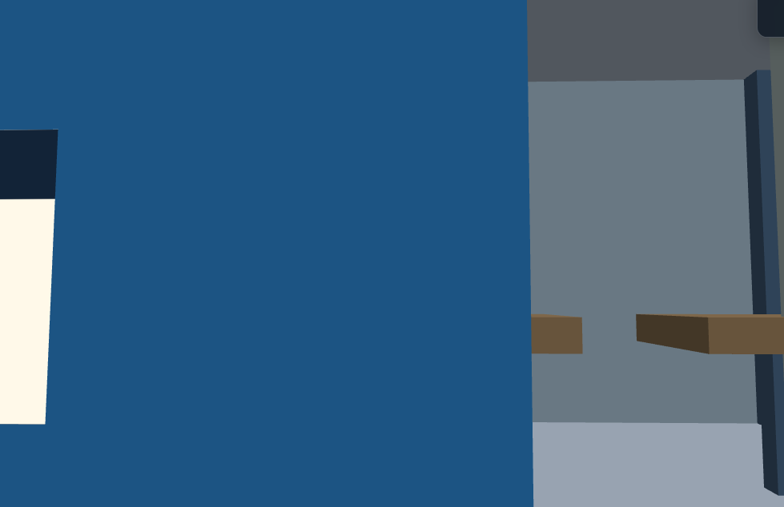

# Week 4 - 3D Observation Interface Improvement

## 1. 조작법

### 1.1 조작법

#### Baseline: 최초 체험한 원본 코드의 조작법

- 실행 링크: 

- 회전: 마우스 좌클릭 후 드래그
- 확대/축소: 마우스 휠
- 이동: 마우스 우클릭 후 드래그
- 전체 보기: Home키

#### Improved: 제작 계획 - 날아다니는 카메라 + 사전 준비된 지점으로 순간이동

- 실행 링크: 

- 회전: 마우스 좌클릭 후 드래그
- 확대/축소: 마우스 휠
- 이동: WASD + 스페이스바 상승 / 왼쪽 Shift 하강
- 이전/다음 지점: Q,E
- 전체 보기: R

---

## 2. Baseline 관찰

### 2.1 관찰 방법

전체 보기에서 시작하여 다음 순서로 관찰하였다.

`P1 → P2 → P3 → P4 → P5 → P6 → O1 → O2 → 전체 보기`

P1-P6은 다음 조건을 만족했을 때 관찰 완료로 판단하였다.

1. 표지의 내용을 읽을 수 있다.
2. 표지가 어느 장치의 정보인지 확인할 수 있다.
3. 해당 장치와 주변 구조의 위치 관계를 설명할 수 있다.

O1과 O2는 두 대상의 구조를 비교하고 판단 근거를 기록하였다.
확실하게 판단할 수 없는 경우에는 판단 보류로 기록하였다.

### 2.2 지점별 관찰 결과

| 지점 | 성공 / 실패 | 걸린 시간 | 불필요한 조작·되돌아가기 | 관찰 결과 및 어려웠던 이유 |
| --- | --- | ---: | --- | --- |
| P1 |  성공|  9초|  건물 수평 맞추기|  ENTRY A / 3층 / 조작법 미숙달로 인한 접근 시간 지연|
| P2 |  성공|  31초|  옆 건물로 갔다가 되돌아온 후 밸브를 제대로 찾지 못해 건물 안을 헤멤.|  V-07 / OPEN / 시선 회전 조작법 숙달이 너무 오래 걸림|
| P3 |  성공|  20초|  우클릭으로 상하 고도를 조작해야 했으나 좌클릭으로 인해 각도만 틀어짐. 바로잡는데 과도한 시간 소모.|  B-12 / 24V / 회전의 기준점을 제대로 설정하기 힘듦.|
| P4 |  성공|  7초|  P2-P3 조작의 반복이기에 쉬었음. 바로 성공.|  Filter / 30일 / 간단한 조작은 익숙해짐|
| P5 |  성공 |  27초|  줌인을 해서 벽을 넘어가고자 함. 당연히 실패.|  Return / 8L/min / 줌 아웃 후 넓은 회전축을 가지고 공전하는 무빙에 미숙달 |
| P6 |  성공|  32초|  P5에서 벽을 빙 둘러서 별관으로 가려고 했으나 조작 미숙으로 초기화 후 접근.|  섭씨 80도 / 별관쪽에서 회전시 회전 기준점이 이상해지는 느낌이 들었음 |
| O1 |  성공|  2분|  정확하고 엄밀한 전면 직교 뷰로 전환하면서 너무 많은 불필요한 조작을 진행함.|  상단 높이는 같지 않음 / 폭은 같은 것으로 판단 / 정확하고 엄밀한 전면 직교 뷰를 세팅하는 것이 원근 표현 때문에 상당히 어려웠음. |
| O2 |  성공|  1분 42초|  건물 벽을 타고 회전하는 과정에서 맞춰둔 건물의 수평이 무너져서 복구하는데 너무 많은 시간을 할애함.|  파란색 A장치가 더 건물 앞으로 돌출되어 있음. P6에서 언급한 대로 별관쪽에서 회전 중심점의 세팅이 이상해지는 문제가 있음. |

### 2.3 O1 비교 결과

- 판단: 상단 높이는 같지 않음 / 폭은 같은 것으로 판단.
- 비교한 요소: 전면 직교 뷰에서 두 장치의 폭(x축 방향)과 높이(y축 방향)를 비교함.
- 판단 근거: 자를 대고 측정했을 때 동일한 모니터에서 동일한 폭을 가짐, 반면 높이는 육안상으로도 큰 차이가 있었음.
- 판단이 어려웠던 점: 원근 투영으로 인해 건물의 뒷부분이 좁게 표현되어 엄밀한 전면 직교 뷰를 세팅하기 까다로움.

### 2.4 O2 비교 결과

- 판단: 파란색 A장치가 더 건물 앞으로 돌출되어 있음.
- 비교한 요소: 측면 직교 뷰에서 두 장치의 z축 방향으로 돌출된 정도를 비교함
- 판단 근거: 육안으로 파란색 A장치가 더 z축 방향으로 돌출됨을 확인함.
- 판단이 어려웠던 점: 원근 투영으로 인해 뷰의 뒷부분이 좁게 표현되어 엄밀한 전면 직교 뷰를 세팅하기 까다로움. O1과 동일한 문제 발생.

---

## 3. Baseline에서 발견한 불편

### 3.1 불편 1 - [트랙볼 조작의 과도한 입문 난이도]



**상황**

O2에서 측면 뷰로 돌아가기 위해 줌아웃 후 회전을 진행함.
이후 건물이 x축을 축으로 회전한 상태로 표현되어 x축 회전을 진행하고자 함.

**발생한 문제**

화면의 양 사이드 부분을 선택하자 정확하게 x축 회전이 작동하지만, 특정한 선을 넘어서 중앙부를 클릭한 후 움직이자 y축 회전이 발생함.
트랙볼 움직임에 상당한 숙련도를 요구하며 직관적이지 않음.

**불필요했던 조작**

- O2를 수행하기 위해 트랙볼을 회전한 x축 미세조정을 하고자 했으나 y축이 과도하게 회전함.
- y축 회전을 복구하자 x축이 또 틀어져서 매우 조심스럽게 x축 오차를 보정함

**관찰에 미친 영향**

- 엄밀한 측면 직교 뷰를 세팅하기 힘들며, 최근 도전한  O2 오퍼레이션 수행 스피드런 세계 신기록 작성에 실패함.

### 3.2 불편 2 - [실내 트랙볼 조작의 비직관성]



**상황**

줌 인하여 건물 안으로 진입 후 트랙볼 조작을 할 경우 조작이 직관적이지 않음.

**발생한 문제**

건물 바깥에서 조작할 경우 (숙련자 기준) 건물을 공굴리듯 컨트롤하는 감각을 익히면 컨트롤이 쉬운데
건물 안에서 조작할 경우 조작감이 상당히 나쁨. 우주 유영을 하거나, 텐트를 안에서 설치하는 느낌과 비슷함.

**불필요했던 조작**

- P3 패널을 읽기 위해 건물 안으로 진입한 시점에서 P3패널을 화면 중앙에 정렬하기 위해 줌아웃 후 회전축 회전 후 줌인을 수 회 조정함

**관찰에 미친 영향**

- P3 조작에 접근하는 시간이 너무 늘어졌으며, 그럼에도 제대로 P3에 접근하지 못해 반쯤 기울어진 상태로 표지판을 읽음.

### 3.3 불편 3 - [줌 인 후 우클릭 평행이동 속도 감소 문제]



**상황**

역시 P3조작에서 발생했으며, P3 패널을 읽으러 건물 안으로 진입하는 순간, 휠을 당겨 줌 인 하는 상태에서 평행이동 속도가 과도하게 느려짐

**발생한 문제**

P3 패널을 읽으러 건물 안으로 진입하는 순간, 휠을 당겨 줌 인 하는 상태에서 평행이동 속도가 과도하게 느려짐

**불필요했던 조작**

- 줌 인 한 상태에서 우클릭 이동이 너무 느려서 줌아웃 한 상태에서 도착지점을 예측하여 이동하고 줌 인을 반복함

**관찰에 미친 영향**

P3 패널에 접근하는 난이도가 수직상승함.

---

## 4. 사용자와 관찰 목표

### 4.1 사용자와 사용 상황

> 위험 현장에 드론을 투입하여 제시된 모든 Task를 진행하는 상황을 시뮬레이션 한다.

### 4.2 주요 관찰 목표 - 8가지의 목표 중 최우선 Target

**목표 1**

P3 명판

**선정 이유**

가장 많은 말썽을 일으킨 접근지점. 실제 건물의 최심부에 위치해 있다.

**목표 2**

O2 Task

**선정 이유**

O2 Task 접근시 트랙볼 조작이 많이 어색함. 그 뿐 아니라 P5와 같이 건물 벽을 따라 빙 돌아가는 Task에서 많은 문제점이 발생했기에, 해당 부분을 피드백하면 한 번에 많은 문제가 해결됨.

---

## 5. 인터페이스 대안 설계

### 5.1 대안 A - [진입용 드론 ]


**방식**

카메라를 하나의 드론으로 보고, wasd키로 상하좌우 이동한다. 또한 좌측 shift키와 스페이스 키를 이용하여 상승과 하강을 표현하며 마우스를 이용하여 드론의 시선을 일정 각도 내에서 조정한다.

**장점**

- 자유로운 건물 내부 탐험을 보장한다.
- 조작이 직관적이다.

**단점**

- 건물을 직접 이동하거나 움직이는 방식이 아니다.
- 건물을 바닥에 고정해두어야 한다.

**Baseline의 어떤 문제를 해결하는가?**

P3와 같이 건물 심부에 위치해 접근이 힘든 점에 직관적으로 접근할 수 있다.

### 5.2 대안 B - [빠른이동 TAXI]


**방식**

8가지의 Task가 각각 적절히 수행되는 지점을 미리 설정 후 좌표를 저장한다. 그리고 Q-E를 눌러서 이전, 이후의 Task로 빠르게 이동한다.

**장점**

- Task만을 빠르게 수행한다는 점에서는 최고의 방안

**단점**

- 수행 지점 간의 위치 관계를 표현하기는 최악의 방안

**Baseline의 어떤 문제를 해결하는가?**

조작에 미숙하여 Task 수행지점 접근이 과도하게 늦춰지는 경우를 방지함. 즉 숙련도 여부에 관계없이 최소한의 성능이 보장됨.

### 5.3 대안 비교

| 비교 항목 | 대안 A | 대안 B |
| --- | --- | --- |
| 빠른 탐색 |  |  O|
| 명판 가독성 |  |  O|
| 위치 파악 |  O|  |
| 누락 방지 |  |  O|
| O1/O2 비교 |  |  O|
| 구현 복잡도 |  |  O|

### 5.4 최종 선택

**선택한 방식**

대안 A와 B를 모두 채택한 하이브리드식

**선택 또는 조합한 이유**

결국 각각의 Task 자체에 집중하는 방식으로는 B안이 최고지만, Task들이 결과적으로 선형적으로 연속된 과제임을 본다면 그 연속성을 잘 표현해줄 A안을 같이 포함하는 것이 좋다고 생각함.

---

## 6. Improved 구현

### 6.1 전체 인터페이스



**구현한 주요 기능**

- 건물과 관찰 대상은 월드 좌표에 고정하고 카메라만 이동·회전하는 Free-Fly 드론 방식
- WASD로 카메라 기준 이동, Space/Left Shift로 월드 Y축 상승·하강을 하며 deltaTime을 반영
- 캔버스 클릭으로 Pointer Lock을 요청하고 마우스로 yaw/pitch 조절, Esc로 잠금을 해제
- Q/E waypoint 이동 + 우상단의 이전·현재·다음 Focus HUD를 추가
- T 키와 HUD 체크박스로 원근/직교 투영을 전환함. 카메라 위치와 방향은 유지함.

### 6.2 P1-P6 관찰 방식

캔버스를 클릭한 뒤 E로 P1부터 순서대로 이동하고 Q로 이전 지점으로 돌아감. 각 이동은 저장된 위치와 초기 방향을 즉시 적용한다. P5는 +Z, 나머지 P1-P4/P6은 -Z를 바라본다. 이동 후에는 마우스 회전과 키보드 자유 이동을 계속 사용할 수 있다. Q/E는 `event.repeat`을 무시해 한 번 눌렀을 때 한 단계만 이동하며, 경계에서 순환하지 않는다. 자유 이동 중에도 마지막으로 선택한 index를 기억한다.

**대표 코드**

```javascript
const waypoints = [
  {name:'P1', position:[-2.3,2.0,7.8], yaw:-Math.PI/2, pitch:0},
  {name:'P2', position:[3.1,1.3,0.5], yaw:-Math.PI/2, pitch:0},
  {name:'P3', position:[-2.9,4.1,2.9], yaw:-Math.PI/2, pitch:0},
  {name:'P4', position:[0.7,9.7,3.3], yaw:-Math.PI/2, pitch:0},
  {name:'P5', position:[-0.3,5.5,-7.4], yaw:Math.PI/2, pitch:0},
  {name:'P6', position:[11.1,1.3,4.1], yaw:-Math.PI/2, pitch:0},
  {name:'O1', position:[10.9,4.8,14.3], yaw:-Math.PI/2, pitch:0},
  {name:'O2', position:[29.8,4.7,-0.6], yaw:Math.PI, pitch:0}
];
if ((e.code === 'KeyQ' || e.code === 'KeyE') && !e.repeat) {
  const next = state.currentWaypointIndex + (e.code === 'KeyQ' ? -1 : 1);
  if (next >= 0 && next < waypoints.length) selectWaypoint(next);
}
```

---

## 7. 카메라 설계

### 7.1 Eye

`eye`는 카메라의 현재 월드 위치다. 시작 시에는 `[3, 8, 30]`이며 waypoint 선택 시 저장된 위치로 이동한다. 건물은 고정되어 있고 `eye`만 입력에 따라 변한다.

대상 위치와 `eye`의 관계: 건물 모델과 카메라 위치는 독립적이며 카메라가 월드 안에서 이동한다. waypoint에서 `eye`는 저장된 관찰 위치와 같다.

```javascript
function camera() {
  return {
    eye: [...state.position],
    target: state.position.map((v, i) => v + state.front[i]),
    up: [...state.up], fov: state.fov
  };
}
```

### 7.2 Target

전체 보기에서 별도의 고정 target 좌표는 사용하지 않는다. 현재 카메라 위치에서 front 방향으로 1 단위 떨어진 점을 target으로 둔다.

상세 보기와 waypoint에서도 같은 규칙을 사용한다. yaw/pitch 또는 마우스 시점이 바뀌면 front가 갱신되어 target도 함께 바뀐다.

```javascript
const target = state.position.map((v, i) => v + state.front[i]);
M.lookAt(view, camera.eye, camera.target, camera.up);
```

### 7.3 Up Vector

사용한 `up`:

```text
(0, 1, 0)  // 월드 up
```

모델의 위쪽이 월드 Y축이기 때문이다. 카메라의 right는 `front × worldUp`, 카메라 up은 `right × front`로 계산해 yaw/pitch 변화에 따라 갱신한다.

### 7.4 대상 크기, FOV와 관찰 거리

대상 크기와 FOV가 관찰 가능 거리에 미치는 영향을 고려하였다. 현재 거리는 waypoint 좌표와 사용자의 자유 이동으로 정하며 자동 계산하지 않는다.

**대상 크기와 거리의 관계**

명판은 카메라에서 멀수록 화면에서 작게 보인다. waypoint를 관찰 지점 가까이에 두었으며, 도착 후에도 자유 이동으로 거리를 조정할 수 있다. 거리 자동 산출은 구현하지 않았다.

**FOV**

기본 FOV는 45도이며 원근 투영에 사용한다. 별도의 줌 입력은 구현하지 않았다.

```javascript
state.fov = 45;
M.perspective(projection, camera.fov * Math.PI / 180, width / height, near, far);
```

### 7.5 자유 회전 중심

**Baseline의 회전 중심**

Baseline은 트랙볼 궤도 관찰 방식이며 초기 회전 target은 `[3, 3, 0]`이다.

**Improved의 회전 중심**

Improved에는 궤도 회전 중심이 없다. 카메라의 `position`, `yaw`, `pitch`를 직접 바꾸며 건물은 고정한다.

**이렇게 설정한 이유**

트랙볼 드래그에서 생기는 회전축 혼란과 실내 접근의 어려움을 줄이고, 관찰자가 필요한 위치로 직접 이동하도록 하기 위해서다. waypoint는 반복 관찰의 시작점을 제공한다.

---

## 8. 원근 투영과 직교 투영

### 8.1 P1-P6

**사용한 투영**

기본값은 Perspective(원근 투영)임. T 키 또는 우상단 체크박스로 Orthographic(직교 투영)과 전환 가능함.

**선택 이유**

P1-P6는 공간 안에서 명판을 찾아 접근해 읽는 작업이므로 기본 원근 투영을 사용함. 비교 시에는 T 키 또는 우상단 체크박스로 직교 투영 전환 가능함. 투영 전환은 카메라 위치와 방향을 바꾸지 않음.

### 8.2 O1 - 전면 직교 뷰



O1 과제는 두 대상의 높이와 폭을 비교하는 과제임. T 키 또는 우상단 체크박스로 현재 카메라의 직교 투영 전환 가능함. O1에 맞춘 전용 카메라 위치·방향은 따로 설정하지 않음.

O1 전용 카메라와 자동 프레이밍은 미구현임. 실제 비교 화면과 측정값은 실행 후 기록해야 함.

**카메라 설정**

- Eye: O1 전용 설정 없음
- Target: O1 전용 설정 없음
- Up: Free-Fly 카메라 up 벡터
- Projection: 원근/직교 토글 가능. 기본은 원근임.
- Orthographic Scale: halfHeight `8`임.

**비교 결과**

- 높이: 미측정
- 폭: 미측정
- 판단 근거: O1 전용 카메라 및 측정 기능 미구현

**전면 직교 뷰를 사용하려는 이유**

직교 투영은 거리별 크기 변화를 제거하므로 패널의 높이와 폭 비교에 적합함. 현재 T 키와 체크박스로 일반 직교 투영을 켤 수 있음. O1에 맞춘 자동 카메라 설정은 없음.

**두 대상에 동일한 배율을 적용한 방법**

직교 투영 시 halfHeight `8`을 사용함. O1 전용 배율은 없음. 원근 투영의 기본 FOV는 45도임.

```javascript
if (camera.orthographic) {
  const half = camera.halfHeight || 8;
  M.ortho(projection, -half * width / height, half * width / height, -half, half, near, far);
} else {
  M.perspective(projection, camera.fov * Math.PI / 180, width / height, near, far);
}
```

### 8.3 O2 - 오른쪽 측면 직교 뷰



O2 과제는 두 대상의 돌출 정도를 비교하는 과제임. T 키 또는 우상단 체크박스로 현재 카메라의 직교 투영 전환 가능함. O2에 맞춘 전용 카메라 위치·방향은 따로 설정하지 않음.

O2 전용 카메라와 자동 프레이밍은 미구현임. 실제 비교 화면과 측정값은 실행 후 기록해야 함.

**카메라 설정**

- Eye: O2 전용 설정 없음
- Target: O2 전용 설정 없음
- Up: Free-Fly 카메라 up 벡터
- Projection: 원근/직교 토글 가능. 기본은 원근임.
- Orthographic Scale: halfHeight `8`임.

**비교 결과**

- 돌출 정도: 미측정
- 판단 근거: O2 전용 카메라 및 측정 기능 미구현

**오른쪽 측면 직교 뷰를 사용하려는 이유**

측면 직교 투영은 깊이 방향 원근 축소를 제거해 장치의 돌출 정도 비교에 적합함. T 키로 직교 투영을 켤 수 있음. O2 waypoint는 -X 방향을 보는 위치만 제공하며 비교 대상에 맞춘 자동 프레이밍은 없음.

**두 대상에 동일한 배율을 적용한 방법**

직교 투영 시 halfHeight `8`을 사용함. O2 전용 배율은 없음. 원근 투영에서는 사용자가 위치와 시점을 조정함.

```javascript
if (camera.orthographic) {
  const half = camera.halfHeight || 8;
  M.ortho(projection, -half * width / height, half * width / height, -half, half, near, far);
} else {
  M.perspective(projection, camera.fov * Math.PI / 180, width / height, near, far);
}
```

---

## 9. 화면 크기와 Aspect Ratio

창의 가로·세로 크기가 변경되어도 화면이 찌그러지지 않도록 다음과 같이 처리하였다.

캔버스 표시 크기와 devicePixelRatio를 바탕으로 drawing buffer를 매 프레임 갱신하고, 투영 행렬에 viewport의 가로/세로 비율을 전달한다. devicePixelRatio는 최대 2로 제한한다. 현재 화면은 단일 뷰다.

```javascript
const dpr = Math.min(devicePixelRatio || 1, 2);
const width = Math.max(1, Math.round(rect.width * dpr));
const height = Math.max(1, Math.round(rect.height * dpr));
M.perspective(projection, fovRadians, width / height, near, far);
```

분할 뷰를 사용하지 않아 각 분할 화면의 aspect ratio 계산은 없다.

단일 Free-Fly 화면에서 위치를 연속적으로 이동하며 관찰하는 구조이기 때문이다.

---

## 10. 가림과 Near Clipping

### 10.1 가림 처리

벽, 난간, 다른 층 등이 관찰 대상을 가리는 문제는 다음과 같이 처리하였다.

깊이 버퍼를 사용해 가까운 geometry가 뒤쪽 geometry를 가리도록 한다. 벽이나 난간을 숨기는 UI는 구현하지 않았다. `viewer.hidden` Set은 확장용 상태로 존재하지만 화면 조작 UI와 연결되어 있지 않다.

숨김 기능을 사용했다면:

- 숨기는 대상: 없음
- 숨김 상태 표시 방법: 해당 없음
- 복원 방법: 해당 없음

숨김 기능을 사용하지 않았다면 그 이유:

이번 개선 범위를 카메라 이동과 waypoint 빠른 이동으로 한정했다. 관찰자는 카메라 위치와 시점을 바꿔 대상에 접근한다.

### 10.2 Near Clipping

카메라가 대상에 너무 가까워 발생하는 near clipping 문제는 다음과 같이 처리하였다.

원근 투영의 near 평면은 0.02, far 평면은 180이다. 키보드 이동은 모델 박스와의 충돌을 막지만 waypoint 순간이동에는 충돌 검사를 적용하지 않는다. near 평면은 자동 조정하지 않으므로 화면이 잘리면 카메라를 뒤로 이동한다.

**가림과 near clipping의 차이**

가림은 다른 geometry가 대상 앞을 덮는 현상이다. Near clipping은 대상이 카메라와 너무 가까워 near 평면 앞쪽이 잘리는 현상이다. 전자는 시선/기하 배치 문제이고 후자는 카메라 절단 평면 문제다.

---

## 11. 상세 관찰과 전체 보기 복귀

### 11.1 상세 관찰

드론 조작으로 각 Task에 직접 접근함. Q/E로 Waypoint를 순서대로 이동할 수도 있음.

### 11.2 전체 보기 복귀

전체 보기로 복귀하는 방법: R키 또는 전체 보기 버튼임. 카메라의 초기 위치와 방향을 복원함. 페이지를 새로고침하지 않음.

전체 보기의 카메라:

- Eye: `(3, 8, 30)`
- Target: `eye + front ≈ (3, 7.851, 29.011)`
- Up: 카메라 up 벡터 `≈ (0, 0.989, -0.149)`
- Projection: Perspective, FOV `45°`, near `0.02`, far `180`

### 11.3 카메라 이동 경로

카메라 이동 중 벽을 통과하거나 방향을 잃는 문제를 다음과 같이 처리하였다.

벽 통과 버그를 확인한 뒤 키보드 이동에 충돌 검사를 추가함. 모델의 각 box를 AABB로 사용하고 카메라 주위에 반경 `0.22m`의 여유를 둠. 이동량을 최대 `0.1m` 단위로 나눠 검사함. 충돌한 축의 이동만 취소하여 벽을 따라 미끄러질 수 있게 함. Waypoint 순간이동은 충돌 검사를 거치지 않음.

---

## 12. Improved 관찰 결과

Baseline과 동일한 관찰 완료 기준으로 Improved를 평가하였다.


| 지점 | 성공 / 실패 | 걸린 시간 | 조작 | 관찰 결과 및 어려웠던 점 |
| --- | --- | ---: | --- | --- |
| P1 |  |  |  |  |
| P2 |  |  |  |  |
| P3 |  |  |  |  |
| P4 |  |  |  |  |
| P5 |  |  |  |  |
| P6 |  |  |  |  |
| O1 |  |  |  |  |
| O2 |  |  |  |  |

---

## 13. Baseline / Improved 비교

두 버전은 가능한 한 동일한 화면 크기, 기기 및 입력 장치에서 평가하였다.

| 비교 항목 | Baseline | Improved | 해석 |
| --- | --- | --- | --- |
| 관찰 완료 수 | /8 | /8 |  |
| 전체 관찰 시간 | 초 | 초 |  |
| 드래그 |  |  |  |
| 휠 이벤트 |  |  |  |
| 키 입력 |  |  |  |
| 전체 보기 |  |  |  |
| 추가 UI 조작 | - |  |  |
| O1 판단 |  |  |  |
| O2 판단 |  |  |  |

### 13.1 불편 1 비교

**Baseline**


**Improved**



- 결과: [해결 / 부분 해결 / 미해결]
- 설명:

### 13.2 불편 2 비교

**Baseline**


**Improved**



- 결과: [해결 / 부분 해결 / 미해결]
- 설명:

### 13.3 불편 3 비교

**Baseline**


**Improved**



- 결과: [해결 / 부분 해결 / 미해결]
- 설명:

---

## 14. Improved에서 새로 발생한 불편

**새로 발생한 문제**

[작성]

**원인**

[작성]

**현재 대응 방법**

[작성]

**추가 개선 방법**

[작성]

---

## 15. 구현 후 추가 수정

### 15.1 수정 전


**발견한 문제**

[작성]

### 15.2 수정 내용

[작성]

```javascript
// 수정한 대표 코드
```

### 15.3 수정 후


**결과**

[작성]

**수정 전보다 나아졌다고 판단한 근거**

[작성]

---

## 16. Copilot 등 AI 활용

### 16.1 AI에게 전달한 요구사항

```text
week4/improved는 제공된 시작 코드를 복사한 폴더다.
이 폴더의 기존 파일과 구조를 먼저 확인하고, 그 코드를 수정·확장해 줘.
week4/baseline은 비교용 원본이므로 수정하지 마.

[실제로 추가한 요구사항 작성]
```

### 16.2 AI가 제안한 중요한 내용

[작성]

### 16.3 나의 판단

- 결정: [채택 / 수정하여 채택 / 거절]
- 이유:

[작성]

### 16.4 AI가 수정한 결과의 검증

다음 사항을 직접 확인하였다.

- 
- 
- 

검증 결과:

[작성]

---

## 17. 측정의 한계

### 17.1 학습 효과

Baseline을 먼저 수행하면서 각 지점의 위치를 학습했기 때문에 Improved 측정에서는 이미 일부 위치를 알고 있었다.

이것이 측정 결과에 미친 영향:

[작성]

이를 줄이기 위해 수행한 방법:

[작성]

### 17.2 입력 장치

휠 이벤트 횟수 등은 입력 장치에 따라 달라질 수 있다.

따라서 수치 외에 다음 관찰 결과도 함께 고려하였다.

[작성]

### 17.3 기타 한계

[작성]

---

## 18. 최종 결과

Baseline에서 발견한 주요 문제는 다음과 같았다.

1. 
2. 
3. 

이를 해결하기 위해 Improved에서는 다음 기능을 구현하였다.

1. 
2. 
3. 

### 최종 비교

- 관찰 완료 수: `Baseline /8 → Improved /8`
- 전체 관찰 시간: `Baseline 초 → Improved 초`
- 조작 부담:
- O1 비교:
- O2 비교:
- 전체 위치 파악:

### 가장 효과적이었던 개선

[작성]

### 아직 남아 있는 문제

[작성]

### 추가로 개선한다면

[작성]
